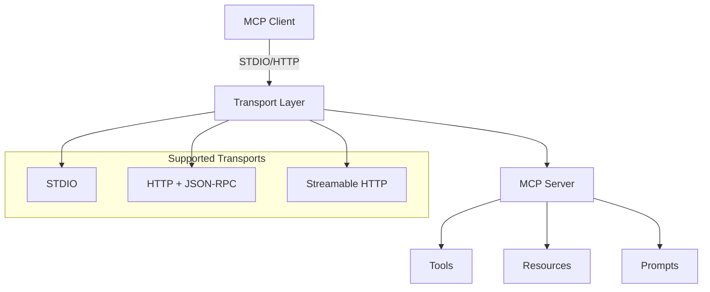

# PHP MCP

A complete PHP implementation of the **Model Context Protocol (MCP)**, providing both server and client functionality with support for multiple transport protocols.

[](https://github.com/dtyq/php-mcp/actions/workflows/ci.yml)
[](https://codecov.io/gh/dtyq/php-mcp)
[](composer.json)
[](LICENSE)
[](https://github.com/dtyq/php-mcp/releases)

> **Language**: [English](./README.md) | [简体中文](./README_CN.md)

## ✨ Key Features

- 🚀 **Latest MCP Protocol** - Supports MCP 2025-03-26 specification
- 🔧 **Complete MCP Implementation** - Full protocol compliance with tools, resources, and prompts
- 🔌 **Multiple Transports** - STDIO ✅, HTTP ✅, Streamable HTTP 🚧
- 📦 **Production Ready** - Suitable for production environments
- 🌐 **Framework Integration** - Compatible with any PHP framework
- 📚 **Comprehensive Documentation** - Complete guides in English and Chinese

## 🚀 Quick Start

```bash
composer require dtyq/php-mcp
```

### Simple Server Example

```php
<?php
require_once 'vendor/autoload.php';

use Dtyq\PhpMcp\Server\McpServer;
use Dtyq\PhpMcp\Shared\Kernel\Application;
use Psr\Container\ContainerInterface;
use Psr\EventDispatcher\EventDispatcherInterface;
use Psr\Log\LoggerInterface;
use Psr\Log\AbstractLogger;

// Create a simple DI container
$container = new class implements ContainerInterface {
    private array $services = [];

    public function __construct() {
        $this->services[LoggerInterface::class] = new class extends AbstractLogger {
            public function log($level, $message, array $context = []): void {
                echo "[{$level}] {$message}\n";
            }
        };

        $this->services[EventDispatcherInterface::class] = 
            new class implements EventDispatcherInterface {
                public function dispatch(object $event): object { return $event; }
            };
    }

    public function get($id) { return $this->services[$id]; }
    public function has($id): bool { return isset($this->services[$id]); }
};

// Create server
$app = new Application($container, ['sdk_name' => 'my-server']);
$server = new McpServer('my-server', '1.0.0', $app);

// Add a simple tool
$server->registerTool(
    new \Dtyq\PhpMcp\Types\Tools\Tool('echo', [
        'type' => 'object',
        'properties' => ['message' => ['type' => 'string']],
        'required' => ['message']
    ], 'Echo a message'),
    function(array $args): array {
        return ['response' => $args['message']];
    }
);

// Start STDIO server
$server->stdio();
```

### Simple Client Example

```php
<?php
require_once 'vendor/autoload.php';

use Dtyq\PhpMcp\Client\McpClient;
use Dtyq\PhpMcp\Shared\Kernel\Application;
// ... same container setup as above ...

// Create client
$app = new Application($container, ['sdk_name' => 'my-client']);
$client = new McpClient('my-client', '1.0.0', $app);

// Connect to server
$session = $client->connect('stdio', ['command' => 'php server.php']);
$session->initialize();

// Call a tool
$result = $session->callTool('echo', ['message' => 'Hello, MCP!']);
echo $result->getContent()[0]->getText(); // "Hello, MCP!"
```

## 📖 Documentation

### Quick Links
- [**📚 Complete Documentation**](./docs/README.md) - All guides and references
- [**🚀 Quick Start Guide**](./docs/en/quick-start.md) - 5-minute tutorial
- [**🔧 Server Guides**](./docs/en/server/) - Create MCP servers
- [**📡 Client Guides**](./docs/en/client/) - Build MCP clients

### Transport Guides
- [**STDIO Transport**](./docs/en/server/stdio-server.md) - Process communication
- [**HTTP Transport**](./docs/en/server/http-server.md) - Web-based communication

### Working Examples
Check the `/examples` directory for complete working implementations:
- `stdio-server-test.php` - Complete STDIO server example
- `stdio-client-test.php` - STDIO client example
- `http-server-test.php` - HTTP server example
- `http-client-test.php` - HTTP client example

## 🏗️ Architecture



### Core Components

1. **Server** (`src/Server/`) - MCP server implementation
2. **Client** (`src/Client/`) - MCP client implementation  
3. **Transport** (`src/Shared/Transport/`) - Communication protocols
4. **Types** (`src/Types/`) - Protocol data structures
5. **Kernel** (`src/Shared/Kernel/`) - Core application framework

## 🌟 Features

### Transport Protocols

| Protocol | Status | Description |
|----------|--------|-------------|
| STDIO | ✅ | Standard Input/Output communication |
| HTTP | ✅ | JSON-RPC over HTTP |
| Streamable HTTP | 🚧 | HTTP POST + Server-Sent Events |

### MCP Capabilities

- ✅ **Tools** - Function calling with dynamic arguments
- ✅ **Resources** - Data access and content management  
- ✅ **Prompts** - Template and prompt management
- ✅ **Error Handling** - Comprehensive error management
- ✅ **Logging** - Structured logging with PSR-3
- ✅ **Events** - Event-driven architecture with PSR-14

## 🔧 Advanced Usage

### Custom Tool Registration

```php
// Register multiple tools
$server
    ->registerTool($calculatorTool, $calculatorHandler)
    ->registerTool($fileReadTool, $fileReadHandler)
    ->registerResource($configResource, $configHandler);
```

### HTTP Server Deployment

```php
// HTTP server with custom endpoint
$response = $server->http($request); // PSR-7 Request/Response
```

### Framework Integration

Compatible with any PHP framework that supports PSR standards:
- **Laravel** - Use with service providers and dependency injection
- **Symfony** - Integrate with Symfony's DI container
- **Hyperf** - Compatible with coroutine environments
- **ThinkPHP** - Works with TP's container system
- **CodeIgniter** - Can be used as a library
- **Custom Frameworks** - Just implement PSR ContainerInterface

## 📊 Current Development Status

### ✅ Completed
- MCP Protocol 2025-03-26 implementation
- STDIO transport (server + client)
- HTTP transport (basic JSON-RPC)
- Core MCP features (tools, resources, prompts)
- Comprehensive documentation
- Working examples

### 🚧 In Progress  
- Streamable HTTP transport (HTTP + SSE)
- Authorization framework (OAuth 2.1)
- JSON-RPC batching support
- Performance optimizations

### 📋 Planned
- Tool annotations and metadata
- Enhanced monitoring and metrics
- Framework-specific integrations
- Docker deployment templates

## 🛠️ Requirements

- **PHP**: 7.4+ (8.0+ recommended)
- **Extensions**: `json`, `mbstring`, `openssl`, `pcntl`, `curl`
- **Composer**: For dependency management

### Dependencies
- **Guzzle HTTP**: For HTTP transport (auto-installed)
- **PSR Log**: For logging (auto-installed)
- **PSR Event Dispatcher**: For events (auto-installed)
- **PSR Container**: For dependency injection (auto-installed)

## 📦 Installation

```bash
# Install via Composer
composer require dtyq/php-mcp

# For development
composer require dtyq/php-mcp --dev
```

## 🤝 Contributing

We welcome contributions! Please see our issues and discussions for areas where you can help.

### Development Setup

```bash
git clone https://github.com/dtyq/php-mcp.git
cd php-mcp
composer install
./vendor/bin/phpunit
```

### Running Tests

```bash
# Run all tests
composer test

# Run unit tests only
composer test:unit

# Run static analysis
composer analyse

# Fix code style
composer cs-fix
```

## 📄 License

This project is licensed under the MIT License - see the [LICENSE](LICENSE) file for details.

## 🙏 Acknowledgments

- [Model Context Protocol](https://modelcontextprotocol.io/) for the specification
- [Anthropic](https://anthropic.com/) for creating MCP
- The PHP community for excellent tooling and support

---

**Star ⭐ this repository if you find it useful!** 