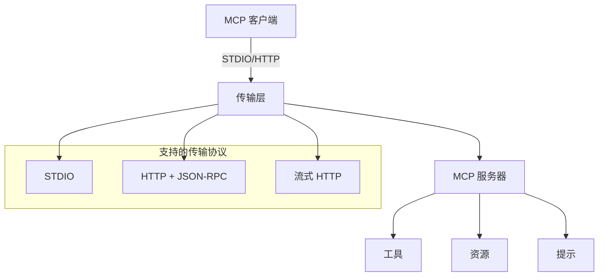

# PHP MCP

**模型上下文协议（MCP）** 的完整 PHP 实现，提供服务器和客户端功能，支持多种传输协议。

[](https://github.com/dtyq/php-mcp/actions/workflows/ci.yml)
[](https://codecov.io/gh/dtyq/php-mcp)
[](composer.json)
[](LICENSE)
[](https://github.com/dtyq/php-mcp/releases)

> **语言版本**: [English](./README.md) | [简体中文](./README_CN.md)

## ✨ 核心特性

- 🚀 **最新 MCP 协议** - 支持 2025-03-26 版本的 MCP 协议
- 🔧 **完整的 MCP 实现** - 完全符合协议规范，支持工具、资源和提示
- 🔌 **多种传输协议** - STDIO ✅、HTTP ✅、流式 HTTP 🚧
- 📦 **生产环境就绪** - 适合生产环境
- 🌐 **框架兼容** - 兼容任何 PHP 框架
- 📚 **完整文档** - 提供中英文完整指南

## 🚀 快速开始

```bash
composer require dtyq/php-mcp
```

### 简单服务器示例

```php
<?php
require_once 'vendor/autoload.php';

use Dtyq\PhpMcp\Server\McpServer;
use Dtyq\PhpMcp\Shared\Kernel\Application;
use Psr\Container\ContainerInterface;
use Psr\EventDispatcher\EventDispatcherInterface;
use Psr\Log\LoggerInterface;
use Psr\Log\AbstractLogger;

// 创建一个简单的 DI 容器
$container = new class implements ContainerInterface {
    private array $services = [];

    public function __construct() {
        $this->services[LoggerInterface::class] = new class extends AbstractLogger {
            public function log($level, $message, array $context = []): void {
                echo "[{$level}] {$message}\n";
            }
        };

        $this->services[EventDispatcherInterface::class] = 
            new class implements EventDispatcherInterface {
                public function dispatch(object $event): object { return $event; }
            };
    }

    public function get($id) { return $this->services[$id]; }
    public function has($id): bool { return isset($this->services[$id]); }
};

// 创建服务器
$app = new Application($container, ['sdk_name' => 'my-server']);
$server = new McpServer('my-server', '1.0.0', $app);

// 添加一个简单工具
$server->registerTool(
    new \Dtyq\PhpMcp\Types\Tools\Tool('echo', [
        'type' => 'object',
        'properties' => ['message' => ['type' => 'string']],
        'required' => ['message']
    ], '回显消息'),
    function(array $args): array {
        return ['response' => $args['message']];
    }
);

// 启动 STDIO 服务器
$server->stdio();
```

### 简单客户端示例

```php
<?php
require_once 'vendor/autoload.php';

use Dtyq\PhpMcp\Client\McpClient;
use Dtyq\PhpMcp\Shared\Kernel\Application;
// ... 使用上面相同的容器设置 ...

// 创建客户端
$app = new Application($container, ['sdk_name' => 'my-client']);
$client = new McpClient('my-client', '1.0.0', $app);

// 连接到服务器
$session = $client->connect('stdio', ['command' => 'php server.php']);
$session->initialize();

// 调用工具
$result = $session->callTool('echo', ['message' => 'Hello, MCP!']);
echo $result->getContent()[0]->getText(); // "Hello, MCP!"
```

## 📖 文档

### 快速链接
- [**📚 完整文档**](./docs/README.md) - 所有指南和参考
- [**🚀 快速开始指南**](./docs/cn/quick-start.md) - 5分钟教程
- [**🔧 服务端指南**](./docs/cn/server/) - 创建 MCP 服务器
- [**📡 客户端指南**](./docs/cn/client/) - 构建 MCP 客户端

### 传输指南
- [**STDIO 传输**](./docs/cn/server/stdio-server.md) - 进程通信
- [**HTTP 传输**](./docs/cn/server/http-server.md) - 基于 Web 的通信

### 实用示例
查看 `/examples` 目录中的完整工作实现：
- `stdio-server-test.php` - 完整的 STDIO 服务器示例
- `stdio-client-test.php` - STDIO 客户端示例
- `http-server-test.php` - HTTP 服务器示例
- `http-client-test.php` - HTTP 客户端示例

## 🏗️ 架构



### 核心组件

1. **服务端** (`src/Server/`) - MCP 服务器实现
2. **客户端** (`src/Client/`) - MCP 客户端实现  
3. **传输** (`src/Shared/Transport/`) - 通信协议
4. **类型** (`src/Types/`) - 协议数据结构
5. **内核** (`src/Shared/Kernel/`) - 核心应用框架

## 🌟 功能特性

### 传输协议

| 协议 | 状态 | 描述 |
|------|------|------|
| STDIO | ✅ | 标准输入输出通信 |
| HTTP | ✅ | HTTP 上的 JSON-RPC |
| 流式 HTTP | 🚧 | HTTP POST + 服务器发送事件 |

### MCP 功能

- ✅ **工具** - 带动态参数的函数调用
- ✅ **资源** - 数据访问和内容管理  
- ✅ **提示** - 模板和提示管理
- ✅ **错误处理** - 全面的错误管理
- ✅ **日志记录** - 使用 PSR-3 的结构化日志
- ✅ **事件** - 使用 PSR-14 的事件驱动架构

## 🔧 高级用法

### 自定义工具注册

```php
// 注册多个工具
$server
    ->registerTool($calculatorTool, $calculatorHandler)
    ->registerTool($fileReadTool, $fileReadHandler)
    ->registerResource($configResource, $configHandler);
```

### HTTP 服务器部署

```php
// 带自定义端点的 HTTP 服务器
$response = $server->http($request); // PSR-7 请求/响应
```

### 框架集成

兼容任何支持 PSR 标准的 PHP 框架：
- **Laravel** - 与服务提供者和依赖注入配合使用
- **Symfony** - 与 Symfony 的 DI 容器集成
- **Hyperf** - 兼容协程环境
- **ThinkPHP** - 与 TP 的容器系统配合
- **CodeIgniter** - 可作为库使用
- **自定义框架** - 只需实现 PSR ContainerInterface

## 📊 当前开发状态

### ✅ 已完成
- MCP 协议 2025-03-26 实现
- STDIO 传输（服务端 + 客户端）
- HTTP 传输（基础 JSON-RPC）
- 核心 MCP 功能（工具、资源、提示）
- 综合文档
- 工作示例

### 🚧 开发中  
- 流式 HTTP 传输（HTTP + SSE）
- 授权框架（OAuth 2.1）
- JSON-RPC 批处理支持
- 性能优化

### 📋 计划中
- 工具注解和元数据
- 增强的监控和指标
- 特定框架集成
- Docker 部署模板

## 🛠️ 系统要求

- **PHP**: 7.4+（推荐 8.0+）
- **扩展**: `json`, `mbstring`, `openssl`, `pcntl`, `curl`
- **Composer**: 用于依赖管理

### 依赖项
- **Guzzle HTTP**: 用于 HTTP 传输（自动安装）
- **PSR Log**: 用于日志记录（自动安装）
- **PSR Event Dispatcher**: 用于事件（自动安装）
- **PSR Container**: 用于依赖注入（自动安装）

## 📦 安装

```bash
# 通过 Composer 安装
composer require dtyq/php-mcp

# 开发版本
composer require dtyq/php-mcp --dev
```

## 🤝 贡献

我们欢迎贡献！请查看我们的问题和讨论区了解可以帮助的领域。

### 开发环境设置

```bash
git clone https://github.com/dtyq/php-mcp.git
cd php-mcp
composer install
./vendor/bin/phpunit
```

### 运行测试

```bash
# 运行所有测试
composer test

# 仅运行单元测试
composer test:unit

# 运行静态分析
composer analyse

# 修复代码风格
composer cs-fix
```

## 📄 许可证

此项目根据 MIT 许可证授权 - 详情请参阅 [LICENSE](LICENSE) 文件。

## 🙏 致谢

- [Model Context Protocol](https://modelcontextprotocol.io/) 提供规范
- [Anthropic](https://anthropic.com/) 创建 MCP
- PHP 社区提供出色的工具和支持

---

**如果您觉得有用，请给这个仓库点个星 ⭐！** 